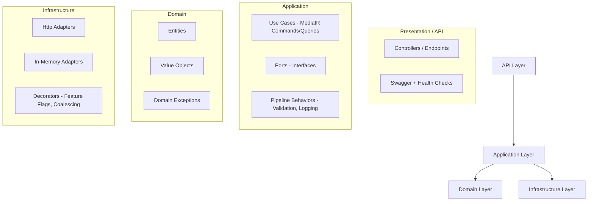

# ThreadPilot


A demo solution in **.NET 8** implementing **Clean Architecture**, **CQRS with MediatR**, and **modern engineering practices**.

It simulates two bounded contexts:
- **Vehicles**: manages vehicle data (lookup by reg number, batch lookup)
- **Insurance**: manages insurance policies and enriches them with vehicle details

The project demonstrates **testability, separation of concerns, feature toggling, centralized error handling, coalescing to avoid duplicate calls, and extensibility**.

## 📐 Architecture

We follow **Clean Architecture** with four layers:



### Why Clean Architecture?
- **Separation of concerns** → testable and maintainable
- Frameworks (ASP.NET, EF, etc.) are details, not core
- Domain is pure C#
- Easier to extend (new APIs, workers, persistence) without touching business rules

### Why MediatR?
- CQRS request/response pattern (queries & commands)
- Centralized pipeline behaviors for validation & logging
- Keeps controllers thin — orchestration belongs to use cases

### Why Feature Flipping?
Enables safe rollout of new features:
- **Vehicles API**: toggle endpoints (`/batch`) with `[FeatureGate]`
- **Insurance API**: toggle enrichment via decorator (short-circuits if disabled)

Flags are configured in `appsettings.json`:
```json
{
  "FeatureManagement": {
    "EnableVehiclesBatchEndpoint": true,
    "EnableInsuranceEnrichment": true
  }
}
```

### Why Coalescing?
Without it, multiple concurrent requests for the same car regs would trigger duplicate HTTP calls.

Using a `SingleFlightCoordinator`, concurrent requests for the same key are merged into one upstream call. This avoids the N+1 problem and reduces load on the Vehicles API.

Decorator chain for Insurance outbound calls:
```
FeatureGatedVehicleLookup        (outermost, skips if flag OFF)
  → CoalescingVehicleLookupAdapter  (merges duplicates in-flight)
    → VehicleLookupHttpAdapter      (real HTTP to Vehicles API)
```

## 🚀 Running the Solution

### Prerequisites
- .NET 8 SDK

### Build & Run
```bash
dotnet restore
dotnet build

# Run Vehicles API (http://localhost:5011/swagger)
dotnet run --project src/Vehicles.Api

# Run Insurance API (http://localhost:5021/swagger)
dotnet run --project src/Insurance.Api
```

### Endpoints

**Vehicles API**
- `GET /v1/vehicles/{reg}` → single vehicle by reg number
- `POST /v1/vehicles/batch` → batch lookup (feature-toggled)

**Insurance API**
- `GET /v1/insurances/{personalNumber}` → insurance summary, optionally enriched with vehicles


## 📊 Seed Data

### Vehicles API
| RegNumber | Make   | Model   | Year | Vin     |
|-----------|--------|---------|------|---------|
| ABC123    | Tesla  | Model 3 | 2020 | VIN-A   |
| XYZ999    | Volvo  | XC90    | 2019 | VIN-X   |
| KLM456    | Toyota | Corolla | 2018 | VIN-K   |

### Insurance API
| Person Number | PolicyType     | MonthlyCost | VehicleRegNumber |
|---------------|----------------|-------------|------------------|
| 19650101-1234 | Pet            | 10 USD      | –                |
| 19650101-1234 | PersonalHealth | 20 USD      | –                |
| 19650101-1234 | Car            | 30 USD      | ABC123           |
| 19650101-1234 | Car            | 30 USD      | ABC123           |
| 19650101-1234 | Car            | 30 USD      | XYZ999           |
| 19700101-1111 | Pet            | 10 USD      | –                |
| 19700101-1111 | PersonalHealth | 20 USD      | –                |

**Try:**
```bash
GET http://localhost:5021/v1/insurances/19650101-1234
```

## 🧪 Testing

```bash
dotnet test
```

**Covers:**
- Domain tests: Entities & value objects
- Application tests: Handlers, validators
- Infrastructure tests: HTTP adapter & decorators
- API integration tests: WebApplicationFactory for both APIs

### Test Pyramid
- **Broad base of unit tests**
- **Fewer integration tests**
- **Only a handful of API tests** (end-to-end)

## ⚠️ Error Handling

Centralized via ProblemDetails (RFC 7807):

| Exception              | HTTP Code | Title           |
|------------------------|-----------|-----------------|
| ValidationException    | 400       | Validation error|
| DomainException        | 422       | Domain error    |
| HttpRequestException   | 502       | Upstream error  |
| all others             | 500       | Server error    |

## 🧩 Extensibility

### Edge Cases Handled
- **Missing vehicles** → policy still returned, vehicle = null
- **No insurances** → empty list, cost = 0
- **Multiple insurances** → aggregated monthly cost, deduplicated vehicle lookups

### API Versioning
- Current APIs use `/v1/...`
- Future versions can live alongside `/v2/...` without breaking clients

## 📌 TODO Roadmap

- [ ] Database persistence with EF Core
- [ ] Caching (infra decorator or edge cache)
- [ ] Resilience with Polly (retry, circuit breaker)
- [ ] Rate limiting (AddRateLimiter)
- [ ] Security (auth, headers, secrets mgmt)
- [ ] Docker support (docker-compose)
- [ ] Makefile (`make up`) for one-command run

## 🛠 Developer Onboarding

1. Clone the repo & install .NET 8
2. Run the APIs locally (`dotnet run`)
3. Explore Swagger:
    - Vehicles → http://localhost:5011/swagger
    - Insurance → http://localhost:5021/swagger
4. Use seed data above to try requests
5. Run tests (`dotnet test`)
6. **Future**: with Docker/Make → just `make up`

## 🔍 Architecture Decisions

- **MediatR** for orchestration (CQRS)
- **Pipeline Behaviors** for Validation & Logging
- **ProblemDetails** for consistent error responses
- **Ports/Adapters** to keep APIs decoupled
- **Feature Flags** for safe rollout

## 🤖 How AI Helped

AI was used during development to:
- **Bootstrap boilerplate**: e.g., pipeline behaviors, DTOs, Swagger setup
- **Testing support**: generating unit + integration test scaffolds quickly
- **Code generation**: repetitive DI extension methods, ProblemDetails handler
- **Performance ideas**: guiding the implementation of coalescing to duplicate HTTP calls

It accelerated delivery but all code was reviewed, refined, and adapted manually to ensure correctness and clarity.

## 🤔 Personal Reflection

In my current role, we also use Clean Architecture and microservices, so this assignment felt familiar. The most interesting part was tackling performance and avoiding N+1 queries, especially through coalescing and batching.

If I had more time, I'd implement the TODOs (EF persistence, caching decorators, resilience with Polly, and Docker support) to make the solution closer to production-ready.

## 🚀 CI/CD

CI runs on every push/PR:
- Build with warnings-as-errors
- Run all tests
- Collect coverage
- Publish summary in GitHub Actions UI

---

**Built with ❤️**