# ThreadPilot


A demo solution in **.NET 9** implementing **Clean Architecture**, **CQRS with MediatR**, and **modern engineering practices**.

It simulates two bounded contexts:
- **Vehicles**: manages vehicle data (lookup by reg number, batch lookup)
- **Insurance**: manages insurance policies and enriches them with vehicle details

The project demonstrates **testability, separation of concerns, feature toggling, centralized error handling, coalescing to avoid duplicate calls, and extensibility**.

## Table of Contents
- [Architecture](#-architecture)
- [Running the Solution](#-running-the-solution)
- [Docker Quick Start](#-docker-quick-start)
- [Endpoints](#endpoints)
- [Seed Data](#-seed-data)
- [Testing](#-testing)
- [Error Handling](#️-error-handling)
- [Performance Considerations](#-performance-considerations)
- [Modern Engineering Practices](#-modern-engineering-practices)
- [Security (Roadmap)](#-security-roadmap)
- [CI/CD & DevOps](#-cicd--devops)
- [Extensibility](#-extensibility)
- [Troubleshooting](#-troubleshooting)
- [TODO Roadmap](#-todo-roadmap)
- [Architecture Decisions](#-architecture-decisions)
- [How AI Helped](#-how-ai-helped)
- [Personal Reflection](#-personal-reflection)

## 📐 Architecture

We follow **Clean Architecture** with four layers:

```mermaid
graph LR
    subgraph "Clients"
        CLI[HTTP Clients]
        CURL[cURL/Postman]
        WEB[Web Apps]
    end

    subgraph VEHICLE_SERVICE["🚗 Vehicle Service"]
        direction TB
        subgraph V_API["API Layer"]
            VAPI[Controllers]
            VSWAG[Swagger/Health]
            VMID[Middleware]
        end
        
        subgraph V_APP["Application Layer"]
            VMED[MediatR Handlers]
            VPORTS[Ports/Interfaces]
            VPIPE[Pipeline Behaviors]
        end
        
        subgraph V_DOMAIN["Domain Layer"]
            VENT[Vehicle Entity]
            VREG[RegistrationNumber VO]
            VDOM[Domain Rules]
        end
        
        subgraph V_INFRA["Infrastructure Layer"]
            VEF[EF Core]
            VMEM[In-Memory Store]
        end
    end

    subgraph INSURANCE_SERVICE["🛡️ Insurance Service"]
        direction TB
        subgraph I_API["API Layer"]
            IAPI[Controllers]
            ISWAG[Swagger/Health]
            IMID[Middleware]
        end
        
        subgraph I_APP["Application Layer"]
            IMED[MediatR Handlers]
            IPORTS[Insurance Ports]
            VPORT[Vehicle Lookup Port]
            IPIPE[Pipeline Behaviors]
        end
        
        subgraph I_DOMAIN["Domain Layer"]
            IENT[Policy Entity]
            IPER[PersonalNumber VO]
            IDOM[Domain Rules]
        end
        
        subgraph I_INFRA["Infrastructure Layer"]
            IEF[EF Core]
            IMEM[In-Memory Store]
            subgraph DECORATORS["Decorator Chain"]
                IFEAT[Feature Gate]
                ICOAL[Coalescing]
                IHTTP[HTTP Adapter]
            end
        end
    end

    subgraph "Database"
        POSTGRES[(PostgreSQL)]
    end

    %% Client connections
    CLI --> VAPI
    CLI --> IAPI
    CURL --> VAPI
    CURL --> IAPI
    WEB --> IAPI

    %% Vehicle Service internal flow
    VAPI --> VMED
    VMED --> VPORTS
    VPORTS --> VEF
    VPORTS --> VMEM
    VPIPE --> VMED

    %% Insurance Service internal flow
    IAPI --> IMED
    IMED --> IPORTS
    IMED --> VPORT
    IPORTS --> IEF
    IPORTS --> IMEM
    IPIPE --> IMED

    %% Service-to-Service Communication
    VPORT --> IFEAT
    IFEAT --> ICOAL
    ICOAL --> IHTTP
    IHTTP -.->|HTTP Call| VAPI

    %% Database connections
    VEF --> POSTGRES
    IEF --> POSTGRES

    %% Styling
    classDef apiLayer fill:#e1f5fe,stroke:#01579b,stroke-width:2px
    classDef applicationLayer fill:#f3e5f5,stroke:#4a148c,stroke-width:2px
    classDef domainLayer fill:#e8f5e8,stroke:#1b5e20,stroke-width:2px
    classDef infraLayer fill:#fff3e0,stroke:#e65100,stroke-width:2px
    classDef external fill:#ffebee,stroke:#c62828,stroke-width:2px
    classDef client fill:#f1f8e9,stroke:#33691e,stroke-width:2px
    classDef service fill:#f8f9fa,stroke:#495057,stroke-width:3px

    class VAPI,VSWAG,VMID,IAPI,ISWAG,IMID apiLayer
    class VMED,VPORTS,VPIPE,IMED,IPORTS,VPORT,IPIPE applicationLayer
    class VENT,VREG,VDOM,IENT,IPER,IDOM domainLayer
    class VEF,VMEM,IEF,IMEM,IHTTP,IFEAT,ICOAL infraLayer
    class POSTGRES external
    class CLI,CURL,WEB client
    class VEHICLE_SERVICE,INSURANCE_SERVICE service
```



### Why Clean Architecture?
- **Separation of concerns** → testable and maintainable
- Frameworks (ASP.NET, EF, etc.) are details, not core
- Domain is pure C#
- Easier to extend (new APIs, workers, persistence) without touching business rules

### Why MediatR?
- CQRS request/response pattern (queries & commands)
- Centralized pipeline behaviors for validation & logging
- Keeps controllers thin — orchestration belongs to use cases

### Why Feature Flipping?
Enables safe rollout of new features:
- **Vehicles API**: toggle endpoints (`/batch`) with `[FeatureGate]`
- **Insurance API**: toggle enrichment via decorator (short-circuits if disabled)

Flags are configured in `appsettings.json`:
```json
{
  "FeatureManagement": {
    "EnableVehiclesBatchEndpoint": true,
    "EnableInsuranceEnrichment": true
  }
}
```

### Why Coalescing?
Without it, multiple concurrent requests for the same car regs would trigger duplicate HTTP calls.

Using a `SingleFlightCoordinator`, concurrent requests for the same key are merged into one upstream call. This avoids the N+1 problem and reduces load on the Vehicles API.

Decorator chain for Insurance outbound calls:
```
FeatureGatedVehicleLookup        (outermost, skips if flag OFF)
  → CoalescingVehicleLookupAdapter  (merges duplicates in-flight)
    → VehicleLookupHttpAdapter      (real HTTP to Vehicles API)
```

## 🚀 Running the Solution

### Prerequisites
- .NET 8 SDK (for local development)
- Docker Desktop (for containerized deployment)

### Build & Run (Local)
```bash
dotnet restore
dotnet build

# Run Vehicles API (http://localhost:5011/swagger)
dotnet run --project src/Vehicles.Api

# Run Insurance API (http://localhost:5021/swagger)
dotnet run --project src/Insurance.Api
```

## 🐳 Docker Quick Start (Use it for running the demo)

Everything below runs via Docker & docker-compose — no local .NET SDK required.

### Prerequisites
- Docker Desktop (Windows/macOS) or Docker Engine + Compose v2 (Linux)
- Ability to pull images from mcr.microsoft.com
- Host ports 8081 and 8082 open

### Quick Start
```bash
# Build and start (first run may take a few minutes)
docker compose up -d --build

# See containers
docker compose ps

# Tail logs
docker compose logs -f postgres
docker compose logs -f vehicles.api
docker compose logs -f insurance.api
```

**Note**: EF Core migrations run automatically on startup when `MIGRATE_ON_STARTUP=true`. Postgres databases are initialized via SQL in `infra/db/init/`.

### URLs
- **Vehicles Swagger**: http://localhost:8081/swagger
- **Insurance Swagger**: http://localhost:8082/swagger
- **Health Checks**:
   - Vehicles → http://localhost:8081/health
   - Insurance → http://localhost:8082/health

### Try it (curl)
```bash
# Vehicles: single lookup
curl -s http://localhost:8081/v1/vehicles/ABC123 | jq

# Vehicles: batch lookup (feature-flagged)
curl -s -X POST http://localhost:8081/v1/vehicles/batch \
  -H "Content-Type: application/json" \
  -d '{"regs":["ABC123","XYZ999","MISSING"]}' | jq

# Insurance: summary (enriched with vehicles)
curl -s http://localhost:8082/v1/insurances/19650101-1234 | jq

# Health checks
curl -i http://localhost:8081/health
curl -i http://localhost:8082/health
```

## Endpoints

**Vehicles API**
- `GET /v1/vehicles/{reg}` → single vehicle by reg number
- `POST /v1/vehicles/batch` → batch lookup (feature-toggled)

**Insurance API**
- `GET /v1/insurances/{personalNumber}` → insurance summary, optionally enriched with vehicles

## 📊 Seed Data

### Vehicles API
| RegNumber | Make   | Model   | Year | Vin     |
|-----------|--------|---------|------|---------|
| ABC123    | Tesla  | Model 3 | 2020 | VIN-A   |
| XYZ999    | Volvo  | XC90    | 2019 | VIN-X   |
| KLM456    | Toyota | Corolla | 2018 | VIN-K   |

### Insurance API
| Person Number | PolicyType     | MonthlyCost | VehicleRegNumber |
|---------------|----------------|-------------|------------------|
| 19650101-1234 | Pet            | 10 USD      | –                |
| 19650101-1234 | PersonalHealth | 20 USD      | –                |
| 19650101-1234 | Car            | 30 USD      | ABC123           |
| 19650101-1234 | Car            | 30 USD      | ABC123           |
| 19650101-1234 | Car            | 30 USD      | XYZ999           |
| 19700101-1111 | Pet            | 10 USD      | –                |
| 19700101-1111 | PersonalHealth | 20 USD      | –                |


## 🧪 Testing

```bash
dotnet test
```

### Test Strategy

**Domain unit tests**: Entities + Value Objects (pure C#, fast feedback).

**Application tests**: MediatR handlers, validators, pipeline behaviors (validation/logging).

**Infrastructure tests**:
- EF Core with SQLite (fast translation checks)
- Migrations smoke with Testcontainers Postgres to validate schema + constraints
- HTTP adapters & decorators (coalescing, feature flags) with fakes

**API integration tests**: Boot real hosts via WebApplicationFactory<Program>. Replace EF/HTTP with in-memory fakes for deterministic behavior.

### Test Pyramid
- **Broad base of unit tests**
- **Fewer integration tests**
- **Only a handful of API tests** (end-to-end)

Coverage is collected in GitHub Actions and summarized in the build output.

## ⚠️ Error Handling

Centralized via ProblemDetails (RFC 7807):

| Exception              | HTTP Code | Title           |
|------------------------|-----------|-----------------|
| ValidationException    | 400       | Validation error|
| DomainException        | 422       | Domain error    |
| HttpRequestException   | 502       | Upstream error  |
| all others             | 500       | Server error    |

## ⚡ Performance Considerations

### Why a Batch Endpoint?

The assignment requires only two endpoints, but I implemented an optional `POST /v1/vehicles/batch` for two reasons:

**Performance realism**: In real systems, the Insurance service often needs multiple vehicle records at once. A batch call allows fewer TCP connections, fewer round trips, and better upstream optimization.

**Clear separation of concerns**: The public contract can remain "one vehicle by reg," while internal consumers (like Insurance) can use batch for efficiency. The batch endpoint is feature-flagged so you can disable it and still fully meet the brief.

### Making Single Lookups Performant

Even with only `GET /v1/vehicles/{reg}`, we can avoid the classic "N requests → N upstream calls" bottleneck through:

**Client-side dedup + limited parallelism**: Before calling Vehicles, deduplicate regs (case-insensitive) and use `Task.WhenAll` with bounded parallelism to avoid stampeding the Vehicles API.

**In-flight de-duplication (SingleFlight)**: Already implemented as a decorator. If 10 requests for ABC123 arrive concurrently, only one upstream call is made; the rest await the same task.

**Caching via decorator**: Wrap the Vehicles port with a cache decorator. For demo data like vehicle metadata (rarely changes), a short TTL cache provides significant performance gains.

**Resilience & backpressure**: Polly retries with jitter, timeouts, and circuit breakers to protect the Vehicles API. Bulkhead patterns cap concurrent outbound calls.

## 🧰 Modern Engineering Practices

**Current**:
- Coalescing to dedupe concurrent calls
- Feature flags for safe rollout
- MediatR pipeline for validation/logging
- EF Core with migrations & seed data

**Roadmap**:
- Resilience with Polly: retry (with jitter), circuit breaker, timeouts
- Caching: decorator with IMemoryCache or Redis; edge cache via gateway/CDN
- Observability: OpenTelemetry traces/metrics/logs → Grafana Tempo/Loki/Prometheus; correlation IDs

## 🔒 Security (Roadmap)

**Current**: Centralized error handling → 400 validation, 422 domain, 502 upstream, 500 server.

**Next steps**:
- AuthN/Z: JWT bearer (Auth0/AWS Cognito/Azure AD) + policies/scopes
- Rate limiting: AddRateLimiter (fixed window/token bucket)
- Secret management: GitHub secrets for CI; AWS SSM/Secrets Manager in prod
- Headers/TLS: HTTPS redirect, HSTS, and secure headers (via middleware or gateway)

## 🚚 CI/CD & DevOps

**CI (present)**: GitHub Actions (build-and-test.yml): restore, build (warnings as errors), tests, coverage, artifacts.

**CD (TODO) – AWS example**:
- Infra with AWS CDK: VPC, ECS Fargate (or App Runner), ALB, RDS Postgres, ECR repos, SSM/Secrets
- Pipeline: Build and push images to ECR, aws-actions/configure-aws-credentials, cdk deploy

## 🧩 Extensibility

### Edge Cases Handled
- **Missing vehicles** → policy still returned, vehicle = null
- **No insurances** → empty list, cost = 0
- **Multiple insurances** → aggregated monthly cost, deduplicated vehicle lookups

### API Versioning
- Current APIs use `/v1/...`
- Future versions can live alongside `/v2/...` without breaking clients


## 📌 TODO Roadmap
- [ ] CD to AWS via CDK (ECS/App Runner + RDS)
- [ ] Caching (infra decorator or edge cache)
- [ ] Resilience with Polly (retry, circuit breaker)
- [ ] Rate limiting (AddRateLimiter)
- [ ] Security (auth, headers, secrets mgmt)
- [ ] Observability (OpenTelemetry → Grafana stack)
- [ ] Makefile (`make up`) for one-command run

## 🛠 Developer Onboarding

### Local Development
1. Clone the repo & install .NET 8
2. Run the APIs locally (`dotnet run`)
3. Explore Swagger:
   - Vehicles → http://localhost:5011/swagger
   - Insurance → http://localhost:5021/swagger
4. Use seed data above to try requests
5. Run tests (`dotnet test`)

### Docker-only Development
1. Clone the repo
2. Start the stack: `docker compose up -d --build`
3. Explore Swagger:
   - Vehicles → http://localhost:8081/swagger
   - Insurance → http://localhost:8082/swagger
4. Try the sample curl requests
5. Run tests using the SDK container (no local SDK needed):
   ```bash
   # bash/zsh (macOS/Linux):
   docker run --rm -v "$PWD:/src" -w /src mcr.microsoft.com/dotnet/sdk:9.0 dotnet test
   
   # PowerShell (Windows):
   docker run --rm -v "${PWD}:/src" -w /src mcr.microsoft.com/dotnet/sdk:9.0 dotnet test
   ```
6. Stop: `docker compose down`

## 🔍 Architecture Decisions

- **MediatR** for orchestration (CQRS)
- **Pipeline Behaviors** for Validation & Logging
- **ProblemDetails** for consistent error responses
- **Ports/Adapters** to keep APIs decoupled
- **Feature Flags** for safe rollout
- **EF Core** with Postgres for persistence
- **Coalescing** (SingleFlight) to merge concurrent outbound calls

## 🤖 How AI Helped

AI was used during development to:
- **Bootstrap boilerplate**: e.g., pipeline behaviors, DTOs, Swagger setup
- **Testing support**: generating unit + integration test scaffolds quickly
- **Code generation**: repetitive DI extension methods, ProblemDetails handler
- **Performance ideas**: guiding the implementation of coalescing to avoid duplicate HTTP calls
- **Docker setup**: generating compose configurations and Dockerfiles

It accelerated delivery but all code was reviewed, refined, and adapted manually to ensure correctness and clarity.

## 🤔 Personal Reflection

In my current role, we also use Clean Architecture and microservices, so this assignment felt familiar. The most interesting part was tackling performance and avoiding N+1 queries, especially through coalescing and batching. The EF integration stayed clean by mapping at the infrastructure edge and keeping the domain pure.

If I had more time, I'd implement the remaining TODOs (CD with CDK, resilience with Polly, caching decorators, and observability) to make the solution closer to production-ready.

## 🚀 CI/CD

CI runs on every push/PR:
- Build with warnings-as-errors
- Run all tests
- Collect coverage
- Publish summary in GitHub Actions UI

---

**Built with ❤️**